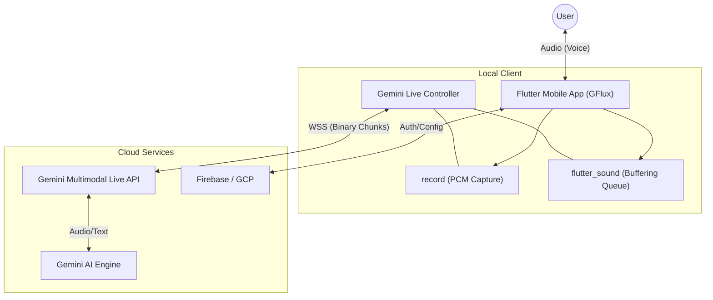
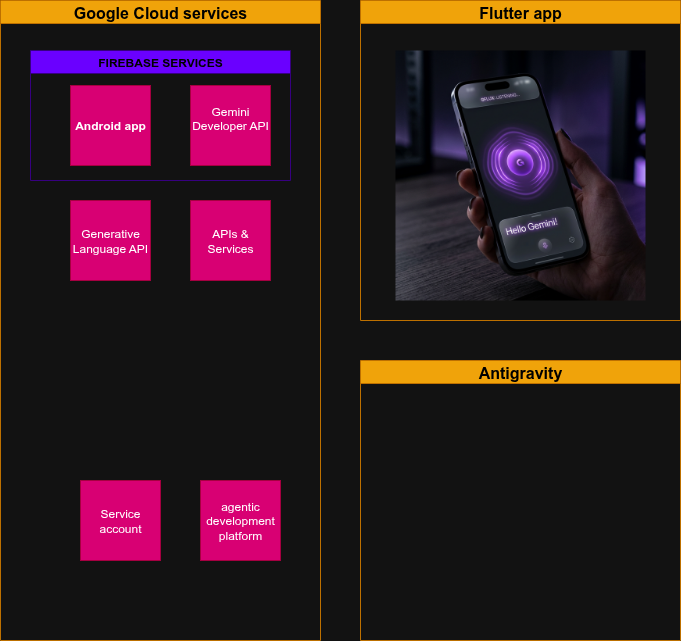

# Project Story: GFlux 🌌

## Inspiration
GFlux was born because: 

1 - I received an email from **Cassie from Devpost** Sun, Mar 1, 2026: Gemini Live Agent Challenge By Google and,
To be completely honest the prize money was what grab my attention first and.

2 - This "idea" was something I tried to develop a few year ago (see original_prod/ dir) yet I didnt find investment (Dubai and HK) and the tech was still not quite available for low latency at low cost. 

3 - The third and last reason is: this is something I want to use myself, I am tired of typing on mobile keyboards not made for humans.

- **Adaptive UI**: A minimal, high-aesthetic interface that pulses and glows in sync with the agent's state, providing intuitive visual feedback.

## Architecture & System Design 🏗️

Below is a high-level representation of how GFlux connects the user to the Gemini Multimodal Live API.

## Built with 🛠️

GFlux is engineered using a modern, high-performance stack designed for low-latency AI interactions:

- **Language**: [Dart](https://dart.dev/)
- **Framework**: [Flutter](https://flutter.dev/) (Targeting Android, iOS, and Web)
- **API**: [Gemini Multimodal Live API](https://ai.google.dev/gemini-api/docs/multimodal-live) (via WebSocket)
- **Cloud Services**: 
  - **Firebase**: Initialized for future authentication and cloud logic.
  - **Google Cloud Platform**: Leveraged for high-bandwidth AI streaming.
- **State Management**: [Provider](https://pub.dev/packages/provider) for clean, reactive state propagation.
- **Audio Processing**:
  - `record`: For high-fidelity PCM audio capture.
  - `flutter_sound`: For low-latency buffered audio playback.
- **Configuration**: `flutter_dotenv` for secure environment variable management.

To handle real-time audio on hardware, we implemented a custom audio pipeline where the duration $d$ of each audio chunk is calculated to ensure perfect timing:
  $$d = \frac{L}{r \cdot b \cdot c}$$
  Where:
  - $L$ = Length of the byte buffer
  - $r$ = Sample rate (24,000 Hz)
  - $b$ = Bytes per sample (2 for 16-bit)
  - $c$ = Number of channels (1 for Mono)

## Challenges we ran into
Building for "Live" interaction meant we couldn't hide behind loading spinners.
1. **Audio Race Conditions**: Initially, incoming audio chunks would "overlap," causing the player to crash or skip on real hardware. We solved this by building a custom **Sequential Playback Queue** that manages the timing between chunks with millisecond precision.
2. **WebSocket Handshakes**: Configuring the initial handshake for `AUDIO` response modalities required precise JSON structures that differed slightly from standard REST APIs.
3. **Hardware Stability**: Testing on real Android hardware (Samsung SM A326B) revealed ADB stability issues and permission hurdles that aren't present in emulators, requiring a more robust service-based architecture.
   laptop only 16G Ram.

## Accomplishments that we're proud of
- **Stable Hardware Deployment**: Moving the project from an emulator to real hardware while maintaining high-fidelity audio.
- **The Queue System**: Developing a non-blocking playback queue that manages real-time PCM data without stuttering.
- **Zero-Secret Repo**: Successfully implementing a secure `.env` and `.gitignore` structure to ensure the project is open-source ready without exposing private API keys.

## What we learned
We delved deep into the mechanics of **Digital Signal Processing (DSP)** and WebSocket states. We learned that "Real-Time" is as much about managing the *user's perception* of time (via UI animations) as it is about the raw speed of the model. We also gained a massive appreciation for the nuance of PCM byte alignment in raw audio streams.

---
*GFlux: Intelligence in motion.*
