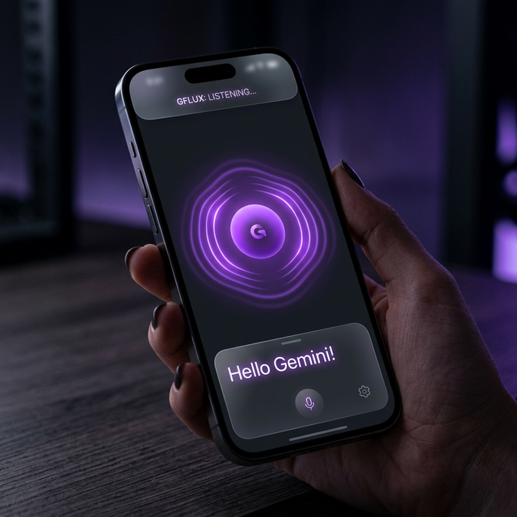

# GFlux 🌌



**GFlux** is a high-performance, real-time multimodal AI agent built for the **Gemini Live Agent Challenge**. It leverages the cutting-edge Gemini Multimodal Live API to provide seamless, low-latency bidirectional voice and text interactions in a premium mobile environment.

---

## ✨ Features

- **🎙️ Live Audio Streaming**: Bidirectional, low-latency audio capture and playback using raw PCM 16-bit streams.
- **⚡ Sequential Playback Queue**: Optimized audio handling to ensure smooth, non-overlapping responses from the AI.
- **🔐 Secure Architecture**: Environment-based API key management using `flutter_dotenv` to protect sensitive credentials.
- **🎨 Premium UI/UX**: A dark, modern aesthetic featuring:
  - Custom animations reacting to session states.
  - Typography powered by **Space Grotesk**.
  - A glassmorphism-inspired design system.
- **🛠️ Clean Agentic Logic**: Separated controller logic for easy scaling and integration with Google Cloud services.

---

## 🚀 Tech Stack

- **Framework**: [Flutter](https://flutter.dev/) (Dart)
- **AI Core**: [Gemini Multimodal Live API](https://ai.google.dev/gemini-api/docs/multimodal-live) (WebSocket Service)
- **State Management**: [Provider](https://pub.dev/packages/provider)
- **Audio Engine**: `record` for capture and `flutter_sound` for low-latency playback.
- **Backend Infrastructure**: Firebase (initialized for future cloud capability).

---

## 🛠️ Getting Started

### Prerequisites
- Flutter SDK (>= 3.5.0)
- A Gemini API Key from [Google AI Studio](https://aistudio.google.com/)

### Setup

1. **Clone the repository**:
   ```bash
   git clone https://github.com/yanncarlier/GFlux.git
   cd GFlux
   ```

2. **Configure Environment Variables**:
   Create a `.env` file in the root directory and add your Gemini API key:
   ```env
   GEMINI_API_KEY=your_actual_api_key_here
   ```

3. **Install Dependencies**:
   ```bash
   flutter pub get
   ```

4. **Run the Application**:
   Connect your Android or iOS device and run:
   ```bash
   flutter run
   ```

---

## 📱 Interaction Guide

- **Single Tap**: Initialize/Start the session. The central frame will pulse when Gemini is listening.
- **Double Tap**: Send a test prompt to verify the text-to-speech visualizer.
- **Listen**: Speak naturally; Gemini will respond in real-time.

---

## 📝 License
This project is built for the Gemini Live Agent Challenge and follows the competition's submission guidelines.

---

*Built with ❤️ for the future of Agentic AI.*
